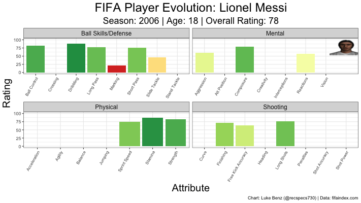

# FIFA (Video Game) Data
This repository contains player data from the FIFA video game from 2005-2020, scraped from [FIFA Index](https://www.fifaindex.com/). Ultimately, I'm hoping to try and build out a modeling system to predict the outcome of real soccer matches using a combination of lineup data and FIFA video game ratings (in addition to other team level variables). The purpose of this is two-fold:

1. Improve my [previous modeling effort](https://github.com/lbenz730/world_cup) which was player agnostic to account for line up changes and player improvement/regression over time.
2. Evaluate how good the FIFA game series is at rating players and teams over time.

This effort will require utilizing other data sources to get real world team lineups and results. In the mean time, I plan to play around with this dataset for fun because there is a lot of interesting information in there. Feel free to explore the data set as well, and [tweet me](https://twitter.com/recspecs730) any cool stuff you explore.

---

### Useful Files

* __fifa_player_data.csv__: csv with all player information (see glossary below)
* __fifa_scraper.R__: R script to scape all player information from FIFA Index
* __player_links.csv__: csv with FIFA Index IDs and links (intermediate scraping step)
* __graphics.R__: Code to make plots with player information

---

`player_evolution("Lionel Messi")`

---

### Future Steps

* Work to standardize teams (Club and National) via FIFA Index team ids
* Pull in overall team ratings (Off/Def/Mid)

---

### Glossary
The following variables are available in the dataset.

* `player_id`: Unique ID for player on FIFA Index
* `name`: Name of player
* `season`: Edition of FIFA in YY format
* `year`: Edition of FIFA in YYYY format
* `page_url`: URL to get player page for given season
* `headshot_url`: URL to get player headshot PNG for given season
* `rating`: Overall Rating
* `club`: Player club
* `nationality`: Player nationality
* `height`: Player height in centimeters
* `weight`: Player weight in kilograms
* `age`: Player age at beginning of game season
* `birthdate`: Player birthdate
* `loaned_from`: Parent club, if player is on loan
* `preferred_foot`: Player preferred foot
* `preferred_positions`: List of player preferred positions
* `player_work_rate_off`: Offensive work rate
* `player_work_rate_def`: Defensive work rate
* `weak_foot`: Weak foot rating (1-5 stars)
* `skill_moves`: Skill moves rating (1-5 stars)
* `value`: Game determined player value ($)
* `value`: Weekly wage ($)
* `country_kit_number`: Player jersey number for national team
* `country_position`: Player position for national team
* `club_kit_number`: Player jersey number for club team
* `club_position`: Player position for club team
* `joined_club`: Date player joined current club
* `contract_length`: Year player contract expires
* `ball_control`: Ball control rating (0-100)
* `dribbling`: Dribbling rating (0-100)
* `marking`: Marking rating (0-100)
* `slide_tackle`: Slide tackle rating (0-100)
* `stand_tackle`: Standing tackle rating (0-100) (Only available after FIFA 11)
* `agression`: Agression rating (0-100)
* `reactions`: Reaction rating (0-100)
* `att_position`: Attacking Position rating (0-100) (Only available after FIFA 11)
* `interceptions`: Interceptions rating (0-100) (Only available after FIFA 11)
* `composure`: Composure rating (0-100) (Only available in FIFA 05-10 and 16-20)
* `vision`: Agression rating (0-100) (Only available after FIFA 11)
* `creativity`: Agression rating (0-100) (Only available in FIFA 05)
* `crossing`: Crossing rating (0-100)
* `short_pass`: Shot pass rating (0-100)
* `long_pass`: Long pass rating (0-100)
* `acceleration`: Acceleration rating (0-100)
* `sprint_speed`: Sprint speed rating (0-100)
* `stamina`: Stamina rating (0-100)
* `strength`: Strength rating (0-100)
* `balance` Balance rating (0-100) (Only available in FIFA 05 and after FIFA 11)
* `agility`: Agility rating (0-100) (Only available after FIFA 11)
* `jumping`: Jumping rating (0-100) (Only available after FIFA 11)
* `heading`: Heading rating (0-100)
* `shot_power`: Shot power rating (0-100) 
* `finishing`: Finishing rating (0-100) (Only available after FIFA 06)
* `long_shots`: Long shots rating (0-100) (Only availble after FIFA 06) 
* `curve`: Curve rating (0-100) (Only available after FIFA 11)
* `penalties`: Penalties rating (0-100) (Only available after FIFA 11)
* `vollies`: Vollies rating (0-100) (Only available after FIFA 11)
* `free_kick_accuracy`: Free kick accuracy rating (0-100) (Only available after FIFA 05)
* `shot_accuracy`:  Shot accuracy rating (0-100) (Only available in FIFA 05)
* `gk_positioning`: Goalie positioning rating (0-100) 
* `gk_diving`: Goalie diving rating (0-100) (Only available after FIFA 06)
* `gk_handling`: Goalie handling rating (0-100) 
* `gk_kicking`: Goalie kicking rating (0-100) (Only availble after FIFA 11)
* `gk_reflexes`: Goalie reflex rating (0-100) 
* `gk_rushing`: Goalie rushing rating (0-100) (Only available in FIFA 05)